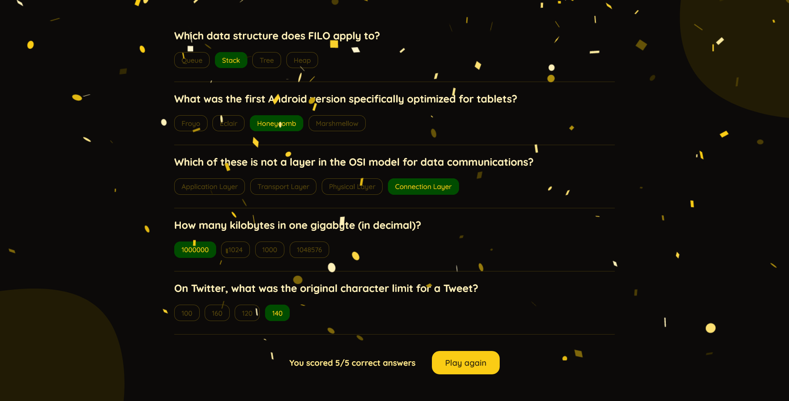

#  Quzzle

Quzzle is an interactive quiz app that challenges users with a set of objective questions from various difficulty levels, focused on computer science.

### Screenshots

### Link

- Live Site URL → [Netlify](https://quzzle.netlify.app)

### Built with

- React

### Acknowledgments

- Icon → [Freepik](https://www.flaticon.com/free-icon/ideas_3261308)
- Nano ID → [Andrey Sitnik](https://github.com/ai/nanoid)
- React Confetti → [Aaron Lampros](https://github.com/alampros/react-confetti)
- Questions → [Open Trivia Database](https://opentdb.com)
